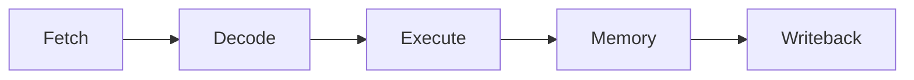
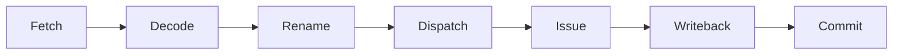

# Computer Architecture Simulators

A collection of computer architecture simulators covering in-order pipeline scheduling, out-of-order execution, configurable cache hierarchy behavior, and dynamic branch prediction.

## Project Scope

This repository demonstrates several core computer architecture concepts:

- pipeline scheduling and load-use hazard detection
- register renaming, issue readiness, and in-order commit
- configurable cache hierarchy simulation
- write-back cache behavior with dirty block handling
- FIFO, LRU, and MRU replacement policies
- dynamic branch prediction with GShare and perceptron predictors

## Repository Structure

```text
.
├── branch-predictors/
│   ├── GShare.py               GShare implementation
│   ├── Custom.py               Perceptron predictor implementation
│   └── graph.png               Accuracy comparison plot
├── cache-simulators/
│   ├── configs/                Cache hierarchy configurations
│   ├── inputs/                 Memory access traces
│   ├── cache.py                Cache implementation
│   ├── driver.py               Simulation driver
│   └── utils.py                Base cache and memory classes
├── dynamic-pipeline/
│   ├── Makefile                Build/run commands
│   ├── dynamic-pipeline.py     Dynamic pipeline simulator
│   └── test.in                 Sample input
├── scalar-pipeline/
│   ├── Makefile                Build/run commands
│   ├── scalar-pipeline.py      Scalar pipeline simulator
│   └── test.in                 Sample input
├── README.md                   Project documentation
└── .gitignore                  Excluded files and build artifacts
```

## Scalar Pipeline

The scalar pipeline simulator models a simplified 5-stage in-order pipeline.



Each instruction starts one cycle after the previous instruction. The simulator models the classic load-use hazard, where an instruction immediately after a load depends on the loaded register before forwarding can supply it. When this occurs, the pipeline inserts one stall cycle before the dependent instruction proceeds.

### Input Format

```text
R,<REG>,<REG>,<REG>
I,<REG>,<REG>,<IMM>
L,<REG>,<IMM>,<REG>
S,<REG>,<IMM>,<REG>
```

| Type | Meaning               | Example                          |
| ---- | --------------------- | -------------------------------- |
| `R`  | R-type instruction    | `ADDU $2, $3, $4` → `R,2,3,4`    |
| `I`  | Immediate instruction | `ADDI $2, $3, 300` → `I,2,3,300` |
| `L`  | Load instruction      | `LW $2, 80($3)` → `L,2,80,3`     |
| `S`  | Store instruction     | `SW $2, 40($8)` → `S,2,40,8`     |

For `R`, `I`, and `L`, the first register is the destination register. For `S`, memory is the destination and is abstracted away. The simulator does not compute memory addresses or execute instruction values. It uses only the register fields needed to identify scheduling hazards.

### Run

```bash
cd scalar-pipeline
make
```

## Dynamic Pipeline

The dynamic pipeline simulator models simplified out-of-order scheduling.



Instructions are fetched and decoded in order, then may issue and complete out of order once their operands are ready. Commit remains in program order through the reorder buffer (ROB).

Implemented components:

- architectural-to-physical register renaming
- physical register free list
- ready table
- issue queue
- reorder buffer with in-order commit
- load and store issue ordering

### Input Format

```text
<PHYSICAL_REGISTERS>,<ISSUE_WIDTH>
R,<REG>,<REG>,<REG>
I,<REG>,<REG>,<IMM>
L,<REG>,<IMM>,<REG>
S,<REG>,<IMM>,<REG>
```

The first line sets the number of physical registers and the issue width. The remaining lines use the same instruction format as the scalar pipeline.

The simulator tracks register dependencies, rename state, issue readiness, writeback timing, and commit order. It does not execute instruction values or model memory contents.

### Run

```bash
cd dynamic-pipeline
make
```

## Cache Simulators

The cache simulator models read and write accesses through a configurable cache hierarchy. It reads a cache configuration and memory trace, then reports hits, misses, evictions, and writebacks.

Configurations define cache levels, cache size, block size, associativity, replacement policy, write policy, and level names. Traces define the read and write operations to simulate.

The simulator uses write-back caching. Writes update the cached block, mark it dirty, and write the block back only when it is evicted or invalidated.

Supported replacement policies:

- **FIFO**: evicts the oldest block in the set
- **LRU**: evicts the least recently used block in the set
- **MRU**: evicts the most recently used block in the set

### Config Format

```text
<NUM_LEVELS>
<CACHE_SIZE>,<BLOCK_SIZE>,<ASSOCIATIVITY>,<REPLACEMENT_POLICY>,<WRITE_POLICY>,<LEVEL_NAME>
```

| Field                | Description                                   |
| -------------------- | --------------------------------------------- |
| `NUM_LEVELS`         | Number of cache levels, excluding main memory |
| `CACHE_SIZE`         | Total cache size in bytes                     |
| `BLOCK_SIZE`         | Cache block size in bytes                     |
| `ASSOCIATIVITY`      | Number of ways per set                        |
| `REPLACEMENT_POLICY` | `FIFO`, `LRU`, or `MRU`                       |
| `WRITE_POLICY`       | `WB` for write-back                           |
| `LEVEL_NAME`         | Cache level label, such as `L1` or `L2`       |

### Trace Format

```text
<OPERATION>,<ADDRESS>
...
```

| Field       | Description                          |
| ----------- | ------------------------------------ |
| `OPERATION` | Read (`R`) or write (`W`)            |
| `ADDRESS`   | Memory address used by the operation |

### Test Coverage

| Config               | Purpose                                                | Input traces                                                        |
| -------------------- | ------------------------------------------------------ | ------------------------------------------------------------------- |
| `one-level-fifo.cfg` | Tests one-level FIFO replacement behavior              | `block-offset-hits.txt`, `fifo-eviction.txt`, `dirty-writeback.txt` |
| `one-level-lru.cfg`  | Tests whether LRU updates replacement order after hits | `lru-eviction.txt`                                                  |
| `one-level-mru.cfg`  | Tests whether MRU evicts the most recently used block  | `mru-eviction.txt`                                                  |
| `two-level-fifo.cfg` | Tests multi-level behavior where L1 misses but L2 hits | `two-level-l2-hit.txt`                                              |

### Run

```bash
cd cache-simulators
python3 driver.py configs/<config>.cfg -t inputs/<input>.txt
```

## Branch Predictors

The branch prediction section compares static and dynamic predictors using benchmark branch traces. Each predictor makes a taken or not-taken prediction, then updates its internal state after the actual branch outcome is known.

Static predictors use fixed rules. Dynamic predictors learn from branch behavior using structures such as Branch History Registers (BHRs), Pattern History Tables (PHTs), saturating counters, and global history.

### GShare `DYNAMIC`

GShare combines the branch address with recent global history. It keeps one global BHR and a PHT of saturating counters. To make a prediction, GShare XORs the low bits of the branch PC with the global history bits to index into the PHT.

Using both address bits and global history helps reduce destructive aliasing compared with indexing by PC alone.

### Custom Perceptron Predictor `DYNAMIC`

The custom predictor is a perceptron branch predictor. It uses recent global branch history as input and computes a weighted sum to predict whether the next branch will be taken.

Each perceptron stores:

```text
1 bias weight + 1 weight per history bit
```

Prediction is based on:

```text
activation = bias + weighted global history
```

A nonnegative activation predicts taken. A negative activation predicts not taken. This design can learn longer global correlations than GShare but is more expensive because it stores signed weights and performs arithmetic during prediction and update.

### Baseline Predictors Used for Comparison

The following predictors were used for comparison but are not included in this repository.

| Type      | Predictor         | Function                                                              |
| --------- | ----------------- | --------------------------------------------------------------------- |
| `STATIC`  | Always Don't Take | Always predicts not taken                                             |
| `STATIC`  | Always Take       | Always predicts taken                                                 |
| `STATIC`  | BTFNT             | Predicts backward branches as taken and forward branches as not taken |
| `DYNAMIC` | Bimodal           | Uses a table of saturating counters indexed by branch address         |
| `DYNAMIC` | Two-Level         | Uses branch history to index into a PHT of saturating counters        |

### Results

Each predictor was tested against multiple branch traces. For each run, the simulator recorded correct predictions, incorrect predictions, and total prediction accuracy.

```text
accuracy = correct predictions / total predictions
```

Dynamic predictors were graphed using their best tested configurations:

| Predictor | Best tested configuration                           |
| --------- | --------------------------------------------------- |
| Bimodal   | 2 counter bits, 1024 table entries                  |
| Two-Level | 4096 BHR entries, 12 history bits, 4096 PHT entries |
| GShare    | 2 counter bits, 1024 PHT entries, 8 history bits    |
| Custom    | 4096 perceptron entries, 12 history bits            |


