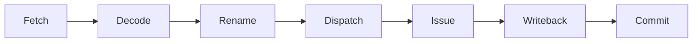
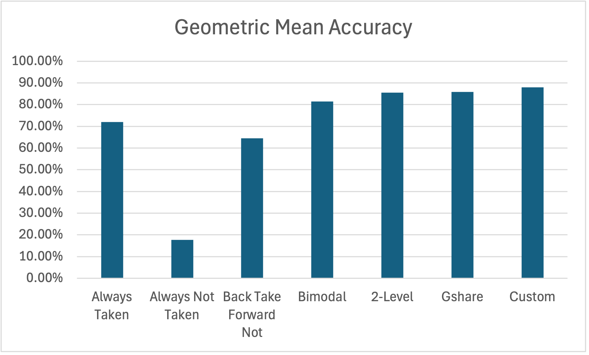

# Computer Architecture Simulators

A collection of computer architecture simulators for pipeline scheduling, cache hierarchy behavior, and branch prediction.

## Repository Structure

```text
.
├── branch-predictors/
│   ├── GShare.py               GShare implementation
│   └── Custom.py               Custom implementation
├── cache-simulators/
│   ├── configs/                Cache hierarchy configurations
│   ├── inputs/                 Memory access traces
│   ├── cache.py                Cache implementation
│   ├── driver.py               Simulation driver
│   └── utils.py                Base cache/memory classes
├── dynamic-pipeline/
│   ├── Makefile                Makefile
│   ├── dynamic-pipeline.py     Dynamic pipeline implementation
│   └── test.in                 Input test
├── scalar-pipeline/
│   ├── Makefile                Makefile
│   ├── scalar-pipeline.py      Scalar pipeline implementation
│   └── test.in                 Input test
├── README.md                   Project documentation
└── .gitignore                  Excluded files and build artifacts
```

## Scalar Pipeline (In-Order)
This scalar pipeline simulator models a simplified 5-stage in-order pipeline:

Each instruction starts one cycle after the previous instruction. The only stall this pipeline supports is when an instruction immediately after a load needs the loaded register before forwarding can supply it. The pipeline will then insert one stall cycle before `Decode`. 

**Input**
```text
R,<REG>,<REG>,<REG>
I,<REG>,<REG>,<IMM>
L,<REG>,<IMM>,<REG>
S,<REG>,<IMM>,<REG>
```
- `R` represents **R-type instructions**, such as `ADDU $2, $3, $4` → `R,2,3,4`
- `L` represents **load instructions**, such as `LW $2, 80($3)` → `L,2,80,3`
- `I` represents **immediate instructions**, such as `ADDI $2, $3, 300` → `I,2,3,300`
- `S` represents **store instructions**, such as `SW $2, 40($8)` → `S,2,40,8`

*Note: This is a simplified instruction format for pipeline scheduling. For `R`, `I`, and `L`, the first register is the destination register. For `S`, memory is the destination, but memory is abstracted away. This pipeline does not calculate memory addresses or execute instructions, it only uses the register fields to detect pipeline hazards.*

**How to run**
```bash
cd scalar-pipeline
make
```
*`test.in` contains a small sample input used for local testing*

## Dynamic Pipeline (Out-of-Order)
The dynamic pipeline simulator models simplified out-of-order scheduling:


Instructions are fetched and decoded in-order, but they may issue and complete out-of-order once their operands are ready. Commit remains in program order through the reorder buffer (ROB).

Implemented pieces:
- architectural to physical registers renaming
- a physical registers free list
- a ready table 
- an issue queue
- in-order commit through a reorder buffer queue
- load/store issue ordering

**Input**
```text
<PHYSICAL_REGISTERS>,<ISSUE_WIDTH>
R,<REG>,<REG>,<REG>
I,<REG>,<REG>,<IMM>
L,<REG>,<IMM>,<REG>
S,<REG>,<IMM>,<REG>
```
- The first line, <PHYSICAL_REGISTERS>,<ISSUE_WIDTH> sets the number of physical registers and issue width for the pipeline
- `R` represents **R-type instructions**
- `L` represents **load instructions**
- `I` represents **immediate instructions**
- `S` represents **store instructions**

*Note: The dynamic pipeline only tracks register dependencies, rename state, issue readiness, writeback timing, and commit order. It does not execute instruction values or model real memory contents so it follows the same instruction concept as the scalar pipeline*

**How to run**
```bash
cd dynamic-pipeline
make
```
*`test.in` contains a small sample input used for local testing*

## Cache Simulators

The cache simulator models read and write accesses through a configurable cache hierarchy. It reads a cache configuration and memory trace, then reports hits, misses, evictions, and writebacks.

Configurations define the cache levels, cache size, block size, associativity, replacement policy, write policy, and level names. Input traces define the read and write operations to simulate.

The simulator supports write-back caching. Writes update the cached block, mark it dirty, and write the block back only when it is evicted or invalidated.

Supported replacement policies:
- **FIFO**: Evicts the oldest block in the set
- **LRU**: Evicts the least recently used block in the set
- **MRU**: Evicts the most recently used block in the set

### Testing
The simulator was tested with multiple self-generated configurations and memory traces.

**Config format**
```text
<NUM_LEVELS>
<CACHE_SIZE>,<BLOCK_SIZE>,<ASSOCIATIVITY>,<REPLACEMENT_POLICY>,<WRITE_POLICY>,<LEVEL_NAME>
```
- `NUM_LEVELS`: Number of cache levels, excluding main memory
- `CACHE_SIZE`: Total cache size in bytes
- `BLOCK_SIZE`: Cache block size in bytes
- `ASSOCIATIVITY`: Number of ways per set
- `REPLACEMENT_POLICY`: FIFO, LRU, or MRU
- `WRITE_POLICY`: WB
- `LEVEL_NAME`: Cache level label, such as L1 or L2

**Input format**
```text
<OPERATION>,<ADDRESS>
...
```
- `OPERATION`: Read (`R`) or write (`W`)
- `ADDRESS`: Memory address used by the operation

| Config | Purpose | Input traces |
|---|---|---|
| `one-level-fifo.cfg` | Tests one-level cache behavior with FIFO replacement. | `block-offset-hits.txt`, `fifo-eviction.txt`, `dirty-writeback.txt` |
| `one-level-lru.cfg` | Tests whether LRU updates replacement order after cache hits. | `lru-eviction.txt` |
| `one-level-mru.cfg` | Tests whether MRU evicts the most recently used block. | `mru-eviction.txt` |
| `two-level-fifo.cfg` | Tests multi-level behavior where L1 can miss while L2 hits. | `two-level-l2-hit.txt` |

**How to run**
```bash
cd cache-simulators
python3 driver.py configs/<config>.cfg -t inputs/<input>.txt
```

## Branch Predictors
This section compares static and dynamic branch predictors using benchmark branch traces. Each predictor makes a taken/not taken prediction, then updates its internal state after the actual branch outcome is known.

Static predictors use fixed rules. Dynamic predictors learn from branch history using structures such as Branch History Registers (BHRs), Pattern History Tables (PHTs), saturating counters, and global history.

### GShare
`DYNAMIC`

GShare combines the branch address with recent global branch history. It keeps one global Branch History Register (BHR) and a Pattern History Table (PHT) of saturating counters.

To predict a branch, GShare XORs the low bits of the branch PC with the global history bits to index into the PHT. Using both address bits and global history helps reduce destructive aliasing compared to indexing only by PC.

### Custom
`DYNAMIC`

The custom predictor is a perceptron branch predictor. It uses recent global branch history as input and computes a weighted sum to predict whether the next branch will be taken.

Each perceptron stores:
```text
1 bias weight + 1 weight per history bit
```

Prediction is based on:
```text
activation = bias + weighted global history
```

If the activation is nonnegative, the predictor chooses taken. If the activation is negative, it chooses not taken.

This design can learn longer global correlations than GShare, but it is more expensive because it stores signed weights and performs arithmetic during prediction and update.

### Predictors Tested Against, Not Included

| Type | Predictor | Function |
|---|---|---|
| `STATIC` | `Always Don't Take` | Always predicts not taken. |
| `STATIC` | `Always Take` | Always predicts taken. |
| `STATIC` | `BTFNT` | Predicts backward branches as taken and forward branches as not taken. |
| `DYNAMIC` | `Bimodal` | Uses a table of saturating counters indexed by branch address. |
| `DYNAMIC` | `Two-Level` | Uses branch history to index into a Pattern History Table of saturating counters. |

### Testing
Each predictor was tested against multiple branch traces. For each run, the simulator recorded correct predictions, incorrect predictions, and total prediction accuracy.
```text
accuracy = correct predictions / total predictions
```

Dynamic predictors were graphed using their best performing tested config:

- **Bimodal**: 2 counter bits, 1024 table entries
- **Two-Level**: 4096 BHR entries, 12 history bits, 4096 PHT entries
- **GShare**: 2 counter bits, 1024 PHT entries, 8 history bits
- **Custom**: 4096 perceptron entries, 12 history bits

